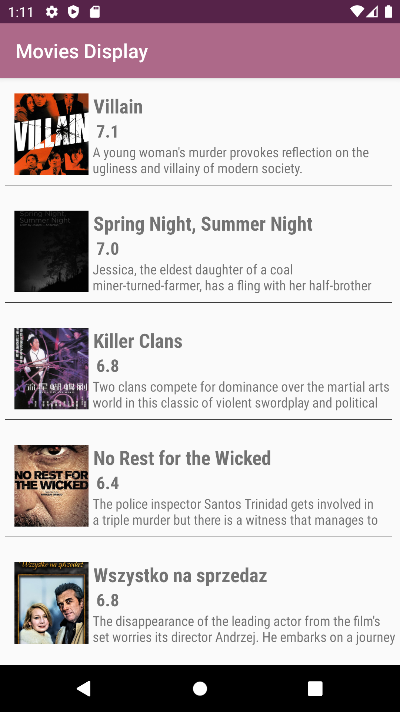
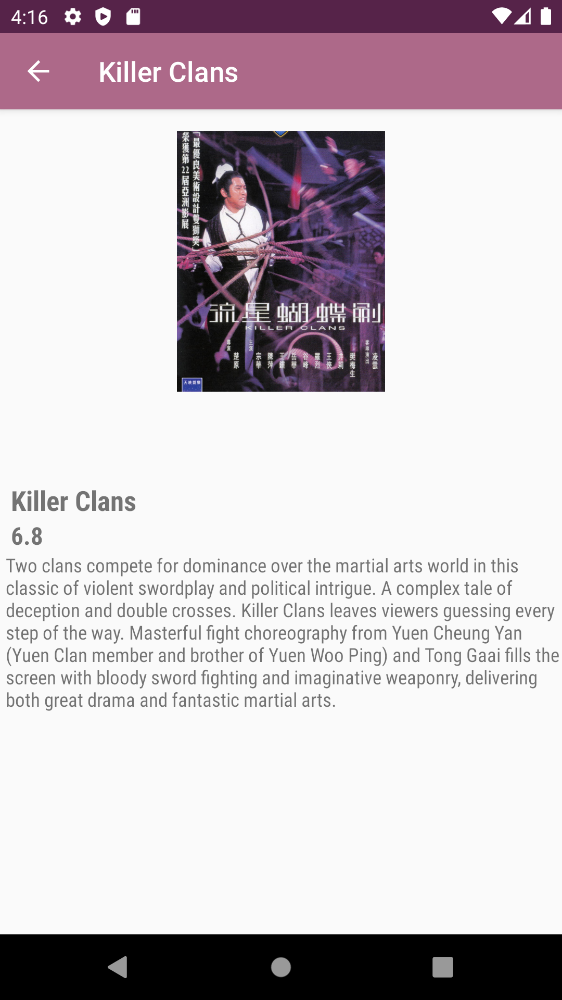

# Movies-Display
### Learning Outcomes
- Implement a RecyclerView.
- Using Intents and passing data through activities.
- Consuming a REST API endpoint using OkHttp
- Deserializing JSON response using gson.
- Using Picasso to cash/load images from URL's.
- Using Kotlin class models to represent data.
- Adding back buttons in activities.
- Change the bar title of an activity.

### To do
- Add star symbols next to the ratings.
- Add buttons that determine the number of requested movies.
- Solve the "too much work being done on one thread" issue/warning.
- Fix the weird back button behavior.

### Screens of the App
1. Home screen

2. Movie screen

### References and Resources
  - https://square.github.io/picasso/
  - https://developer.android.com/guide/topics/ui/layout/recyclerview
  - https://www.youtube.com/watch?v=53BsyxwSBJk&list=PL0dzCUj1L5JGfHj1lwxOq67zAJV3e1S9S&index=2
  - https://classroom.udacity.com/courses/ud9012
  - Color palette https://colorhunt.co/palette/181988
